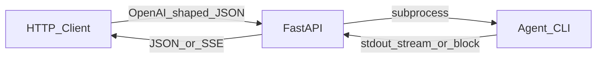

# proxy-agent

[](https://www.python.org/downloads/)
[](https://pytest.org/)
[](LICENSE)

将本机 **Agent CLI**（例如 Cursor 的 `agent -p`）包装成 **OpenAI Chat Completions** 兼容的 HTTP 服务，便于在任意支持 OpenAI API 的客户端里使用本地代理。

---

## 特性

- **兼容端点**：`GET /v1/models`、`POST /v1/chat/completions`
- **流式输出**：`stream: true` 时以 **SSE** 返回 `chat.completion.chunk`
- **可插拔 CLI**：通过环境变量配置命令与参数模板（`{prompt}` 占位）
- **Cursor stream-json**：默认解析 `stream-json` NDJSON；也可选 **透传**（`passthrough`）
- **可选鉴权**：设置 `API_KEY` 后要求 `Authorization: Bearer …`
- **容器化**：提供 [`Dockerfile`](Dockerfile) 与 [`docker-compose.yml`](docker-compose.yml)

## 架构



## 快速开始

### 本地开发

```bash
python3 -m venv .venv && source .venv/bin/activate
pip install -e ".[dev]"
pytest
uvicorn proxy_agent.app:app --host 0.0.0.0 --port 8000
```

或使用入口脚本（默认监听 `0.0.0.0:8000`）：

```bash
proxy-agent
```

### Docker

```bash
docker compose up -d --build
```

默认映射 `8000`。可通过环境变量 `PROXY_AGENT_PORT` 修改宿主机端口。项目根目录可选放置 `.env`（Compose 中 `required: false`，不存在也不报错）。

**Cursor CLI**：构建镜像时会执行官方安装脚本（与 [Cursor 文档](https://cursor.com/docs/cli/headless) 一致），将 `agent` 安装到 `/root/.local/bin` 并已加入 `PATH`，默认 `AGENT_COMMAND=agent` 即可。无头环境需在 `.env` 或运行环境中提供 **`CURSOR_API_KEY`**（[Headless CLI](https://cursor.com/docs/cli/headless)）；若改用其他可执行文件，仍可通过 `AGENT_COMMAND` / `AGENT_CWD` 覆盖。

## 配置说明

配置来自环境变量，以及可选的项目目录下 [`.env`](https://docs.pydantic.dev/latest/concepts/pydantic_settings/#dotenv-env-support)（与 [`Settings`](src/proxy_agent/config.py) 字段对应；名称不区分大小写）。

| 环境变量 | 说明 | 默认 |
|----------|------|------|
| `AGENT_COMMAND` | 要执行的 CLI 可执行文件名或路径 | `agent` |
| `AGENT_ARGS_STANDARD_TEMPLATE` | 非流式请求的参数模板，`{prompt}` 为拼接后的用户侧文本 | `-p --output-format text {prompt}` |
| `AGENT_ARGS_STREAM_TEMPLATE` | 流式请求的参数模板 | `-p --output-format stream-json --stream-partial-output {prompt}` |
| `AGENT_STREAM_PROTOCOL` | `cursor_ndjson`（解析 Cursor NDJSON）或 `passthrough`（原样转发 stdout 片段） | `cursor_ndjson` |
| `AGENT_STANDARD_OUTPUT_FORMAT` | 非流式下对 CLI 标准输出的解释：`text` 或 `json`（需含字符串字段 `result`） | `text` |
| `AGENT_CWD` | 子进程工作目录 | （未设置） |
| `AGENT_TIMEOUT_SEC` | 单次调用超时（秒） | `300` |
| `AGENT_SUBPROCESS_STREAM_LIMIT` | asyncio 流读取缓冲上限（字节），不低于 1MiB | `16777216` |
| `AGENT_STREAM_STDOUT_CHUNK_SIZE` | 透传/块读时的 stdout 读取块大小；`cursor_ndjson` 流式路径内部会按行模式处理 | `4096` |
| `AGENT_USE_STDBUF` | 是否在支持时用 `stdbuf -oL -eL` 包裹命令以改善行缓冲 | `true` |
| `AGENT_MESSAGES_FORMAT` | `transcript`（多轮对话拼成 transcript）或 `last_user_only`（仅最后一条用户消息） | `transcript` |
| `AGENT_MAX_PROMPT_CHARS` | `transcript` 模式下全文长度上限，`0` 表示不限制 | `0` |
| `AGENT_SSE_COMMENT_INTERVAL_SEC` | SSE 注释心跳间隔（秒），`0` 关闭 | `15` |
| `AGENT_STREAM_EOF_PROCESS_WAIT_SEC` | stdout 结束后等待进程退出的时间（秒） | `30` |
| `AGENT_STREAM_CHECK_CLIENT_DISCONNECT` | 是否在流式响应中检测客户端断开（默认关闭） | `false` |
| `API_KEY` | 若设置，则 `GET/POST /v1/*` 需 `Bearer` 匹配 | （未设置，不校验） |
| `DEFAULT_MODEL` | `/v1/models` 与省略 `model` 时的默认模型名 | `auto` |

## API 示例

未设置 `API_KEY` 时无需请求头。

**列出模型**

```bash
curl -sS http://127.0.0.1:8000/v1/models
```

**非流式补全**

```bash
curl -sS http://127.0.0.1:8000/v1/chat/completions \
  -H "Content-Type: application/json" \
  -d '{"model":"auto","messages":[{"role":"user","content":"hello"}]}'
```

**流式补全（SSE）**

```bash
curl -sS -N http://127.0.0.1:8000/v1/chat/completions \
  -H "Content-Type: application/json" \
  -d '{"model":"auto","messages":[{"role":"user","content":"hello"}],"stream":true}'
```

若已设置 `API_KEY`：

```bash
curl -sS http://127.0.0.1:8000/v1/models \
  -H "Authorization: Bearer your-secret"
```

## Hermes 协作工作流

如果你希望把本项目当成 **Hermes ↔ Cursor agent** 的中转层使用：

- 协作文档：[`docs/hermes-proxy-workflow.md`](docs/hermes-proxy-workflow.md)
- 命令行辅助脚本：[`scripts/hermes_proxy_chat.py`](scripts/hermes_proxy_chat.py)

最小例子：

```bash
python3 scripts/hermes_proxy_chat.py "Summarize this repository"
```

指定 base URL：

```bash
python3 scripts/hermes_proxy_chat.py --base-url http://127.0.0.1:8088 "Review this diff"
```

通过 stdin 发送较长上下文：

```bash
cat /tmp/context.txt | python3 scripts/hermes_proxy_chat.py --stdin
```

## 项目结构

实现按职责分布在 [`src/proxy_agent/`](src/proxy_agent/) 下，例如：

| 模块 | 职责 |
|------|------|
| [`config.py`](src/proxy_agent/config.py) | `Settings` / `get_settings` |
| [`cli_runner.py`](src/proxy_agent/cli_runner.py) | 子进程执行与 stdout 流 |
| [`cursor_stream.py`](src/proxy_agent/cursor_stream.py) | Cursor `stream-json` / 标准输出解析 |
| [`api_models.py`](src/proxy_agent/api_models.py) | OpenAI 形请求与响应模型 |
| [`prompts.py`](src/proxy_agent/prompts.py) | `messages` → CLI 文本 |
| [`sse.py`](src/proxy_agent/sse.py) | SSE 帧与非流式补全 JSON |
| [`streaming.py`](src/proxy_agent/streaming.py) | 流式补全迭代器与 SSE 心跳合并 |
| [`app.py`](src/proxy_agent/app.py) | FastAPI `create_app`、`app` 实例、`run()`，并 **向后兼容** 导出测试与集成常用的符号 |

`from proxy_agent import app` 得到的是 **FastAPI 应用对象**；Python 子模块 `proxy_agent.app` 仍是 [`app.py`](src/proxy_agent/app.py) 模块本身（例如 `importlib.import_module("proxy_agent.app")`）。

## 开发与测试

```bash
pip install -e ".[dev]"
pytest
```

## 贡献

欢迎 Issue 与 PR：请尽量附带可复现步骤或测试用例；提交前在本地运行 `pytest`。

## 许可证

本项目采用 [MIT 许可证](LICENSE) 发布。
